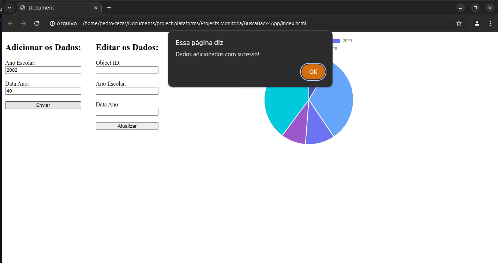
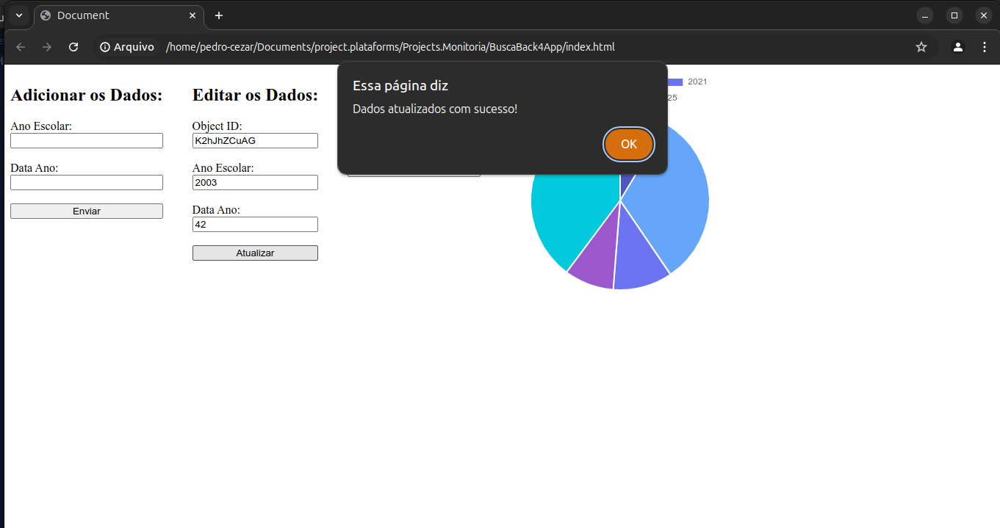
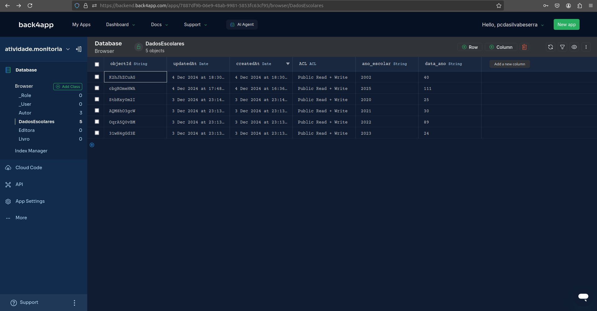

# Projeto Monitoria de Programação para Web

Este projeto foi desenvolvido para auxiliar os alunos da monitoria de Programação para Web a fazer requisições ao Back4App e retornar dados de uma maneira interativa e prática.

## Índice

1. [Descrição do Projeto](#descrição-do-projeto)
2. [Tecnologias Utilizadas](#tecnologias-utilizadas)
3. [Configuração do Ambiente](#configuração-do-ambiente)
4. [Funcionalidades](#funcionalidades)
    - [Adicionar Dados](#adicionar-dados)
    - [Editar Dados](#editar-dados)
    - [Deletar Dados](#deletar-dados)
    - [Visualizar Gráfico](#visualizar-gráfico)
5. [Imagens do Projeto](#imagens-do-projeto)
6. [Imagens do Back4App](#imagens-do-back4app)
7. [Execução do Projeto](#execução-do-projeto)

## Descrição do Projeto

Este projeto consiste em uma aplicação web simples que permite a interação com uma base de dados hospedada no Back4App. Através da aplicação, é possível adicionar, editar e deletar registros, além de visualizar os dados em um gráfico interativo.

## Tecnologias Utilizadas

- HTML
- JavaScript
- Chart.js
- Back4App (Parse Server)

## Configuração do Ambiente

1. Clone este repositório para o seu ambiente local.
2. Abra o arquivo `index.html` em um navegador web.

## Funcionalidades

### Visualizar Gráfico

Os dados recuperados do Back4App são exibidos em um gráfico de pizza interativo utilizando a biblioteca Chart.js.

```html
<canvas id="chart1" width="200" height="200"></canvas>
```

### Função para Buscar Dados e Exibir Gráfico

```javascript
fetch('https://parseapi.back4app.com/parse/classes/DadosEscolares', {
    headers: {
        'X-Parse-Application-Id': 'Tt6MdVmxrzFbGaZghaamPyARNAekoCRRyPtyNX5v',
        'X-Parse-REST-API-Key': 'C15PqeztDAugVqSm1dOCSm8Lp4ZYfJh3lppbKObM'
    }
})
.then(response => response.json())
.then(data => {
    const labels = [];
    const data_chart = [];

    console.log("Data from API:", data);

    const resultados = data.results || data;
    for (let i = 0; i < resultados.length; i++) {
        labels.push(resultados[i].ano_escolar);
        data_chart.push(parseInt(resultados[i].data_ano, 10));
    }

    console.log("Labels:", labels);
    console.log("Data Chart:", data_chart);

    var ctx4 = document.getElementById("chart1").getContext("2d");
    var chart4 = new Chart(ctx4, {
        type: "pie",
        data: {
            labels: labels,
            datasets: [{
                label: "Gráfico de Rosca",
                data: data_chart,
                backgroundColor: ["#5056BF", "#65A6FA", "#6D74F2", "#9B57CC", "#00CADC"],
                borderColor: "#FFFFFF",
                borderWidth: 2
            }]
        }
    });
})
.catch(error => {
    console.error('Erro:', error);
});
```

### Adicionar Dados

O formulário de adicionar dados permite inserir um novo registro na base de dados. Preencha os campos "Ano Escolar" e "Data Ano" e clique em "Enviar".

```html
<form id="dadosForm">
    <label for="ano_escolar">Ano Escolar:</label>
    <input type="text" id="ano_escolar" name="ano_escolar" required>
    <br>
    <label for="data_ano">Data Ano:</label>
    <input type="number" id="data_ano" name="data_ano" required>
    <br>
    <button type="submit">Enviar</button>
</form>
``` 
### Função para Adicionar um Registro

```javascript
document.getElementById('dadosForm').addEventListener('submit', function(event) {
    event.preventDefault();

    const anoEscolar = document.getElementById('ano_escolar').value;
    const dataAno = document.getElementById('data_ano').value;

    const dados = {
        ano_escolar: anoEscolar,
        data_ano: dataAno
    };

    function adicionarDados(dados) {
        fetch('https://parseapi.back4app.com/parse/classes/DadosEscolares', {
            method: 'POST',
            headers: {
                'X-Parse-Application-Id': 'Tt6MdVmxrzFbGaZghaamPyARNAekoCRRyPtyNX5v',
                'X-Parse-REST-API-Key': 'C15PqeztDAugVqSm1dOCSm8Lp4ZYfJh3lppbKObM',
                'Content-Type': 'application/json'
            },
            body: JSON.stringify(dados)
        })
        .then(response => response.json())
        .then(data => {
            console.log('Success:', data);
            alert('Dados adicionados com sucesso!');
        })
        .catch((error) => {
            console.error('Error:', error);
            alert('Erro ao adicionar dados.');
        });
    }

    adicionarDados(dados);
});
```

### Editar Dados

O formulário de editar dados permite atualizar um registro existente. Informe o ID do objeto que deseja editar, juntamente com os novos valores para "Ano Escolar" e "Data Ano".

```html
<form id="editarForm">
    <label for="objectId">Object ID:</label>
    <input type="text" id="editObjectId" name="objectId" required>
    <br>
    <label for="ano_escolar">Ano Escolar:</label>
    <input type="text" id="editAnoEscolar" name="ano_escolar" required>
    <br>
    <label for="data_ano">Data Ano:</label>
    <input type="number" id="editDataAno" name="data_ano" required>
    <br>
    <button type="submit">Atualizar</button>
</form>
``` 

### Função para editar um Registro

```javascript
document.getElementById('editarForm').addEventListener('submit', function(event) {
    event.preventDefault();

    const objectId = document.getElementById('editObjectId').value;
    const anoEscolar = document.getElementById('editAnoEscolar').value;
    const dataAno = document.getElementById('editDataAno').value;

    const dadosAtualizados = {};
    if (anoEscolar) {
        dadosAtualizados.ano_escolar = anoEscolar;
    }
    if (dataAno) {
        dadosAtualizados.data_ano = dataAno;
    }
    console.log(dadosAtualizados);

    fetch(`https://parseapi.back4app.com/parse/classes/DadosEscolares/${objectId}`, {
        method: 'PUT',
        headers: {
            'X-Parse-Application-Id': 'Tt6MdVmxrzFbGaZghaamPyARNAekoCRRyPtyNX5v',
            'X-Parse-REST-API-Key': 'C15PqeztDAugVqSm1dOCSm8Lp4ZYfJh3lppbKObM',
            'Content-Type': 'application/json'
        },
        body: JSON.stringify(dadosAtualizados)
    })
    .then(response => response.json())
    .then(data => {
        console.log('Success:', data);
        alert('Dados atualizados com sucesso!');
    })
    .catch((error) => {
        console.error('Error:', error);
        alert('Erro ao atualizar dados.');
    });
});
```

### Deletar Dados

O formulário de deletar dados permite remover um registro da base de dados. Informe o ID do objeto que deseja deletar e clique em "Deletar".

```html
<form id="deletarForm">
    <label for="deleteObjectId">Object ID:</label>
    <input type="text" id="deleteObjectId" name="deleteObjectId" required>
    <br>
    <button type="submit">Deletar</button>
</form>
```

### Função para Deletar um Registro

```javascript
document.getElementById('deletarForm').addEventListener('submit', function(event) {
    event.preventDefault();

    const objectId = document.getElementById('deleteObjectId').value;

    fetch(`https://parseapi.back4app.com/parse/classes/DadosEscolares/${objectId}`, {
        method: 'DELETE',
        headers: {
            'X-Parse-Application-Id': 'Tt6MdVmxrzFbGaZghaamPyARNAekoCRRyPtyNX5v',
            'X-Parse-REST-API-Key': 'C15PqeztDAugVqSm1dOCSm8Lp4ZYfJh3lppbKObM',
            'Content-Type': 'application/json'
        }
    })
    .then(response => {
        if (response.ok) {
            return response.json();
        } else {
            throw new Error('Erro ao deletar dados.');
        }
    })
    .then(data => {
        console.log('Success:', data);
        alert('Dados deletados com sucesso!');
    })
    .catch((error) => {
        console.error('Error:', error);
        alert('Erro ao deletar dados.');
    });
});
```
## Imagens do Projeto

Aqui estão algumas capturas de tela da interface da aplicação web, incluindo os formulários de adição, edição, deleção de dados e o gráfico gerado:





## Imagens do Back4App

Adicione imagens das configurações do Back4App, como as colunas e os dados inseridos na base de dados:



Este projeto é uma excelente maneira de aprender como integrar aplicações web com bases de dados em nuvem utilizando o Back4App e visualização de dados com Chart.js. Sinta-se à vontade para explorar, modificar e expandir as funcionalidades conforme necessário.

Esperamos que este guia ajude você a configurar e entender o projeto. Qualquer dúvida, entre em contato!